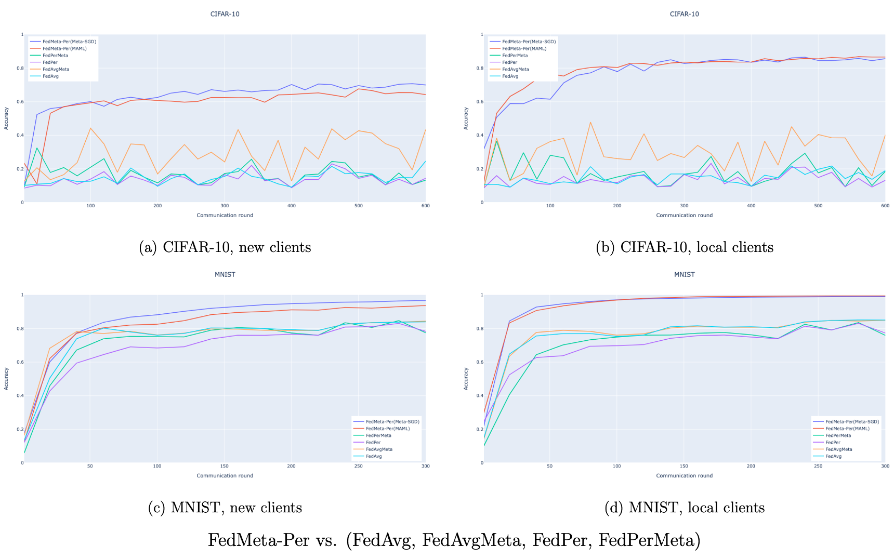
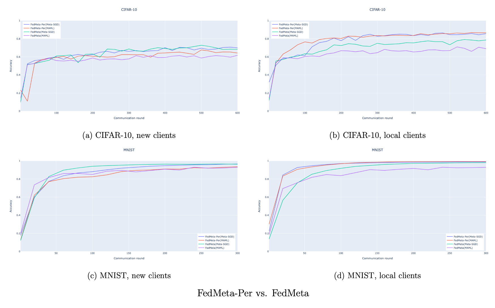

# Meta-learning và Personalization layer trong Federated learning

## Thông tin khoá luận

- Tên đề tài: Meta-learning và Personalization layer trong Federated learning
- GVHD: GS. TS. Lê Hoài Bắc
- GVPB: TS. Nguyễn Tiến Huy
- Nhóm sinh viên:
    - Nguyễn Bảo Long - MSSV: 18120201
    - Cao Tất Cường - MSSV: 18120296
- Bảo vệ vào ngày 15/03/2022 tại Hội đồng Khoa học máy tính 1, Trường Đại học Khoa học Tự nhiên, TP. HCM

## How to run

- Dữ liệu được cấu hình giống như paper: Personalized Federated Learning with Moreau Envelopes (NeurIPS 2020).

- Có 2 cách để khởi chạy simulation (đọc doc của Flower để rõ thêm):

    - Chạy 1 mạch và khỏi suy nghĩ gì: Chạy file `run.sh`. Trong file này chứa toàn bộ lệnh để tạo ra kết quả của khoá luận. Khi chạy theo kiểu này, chương trình sẽ gọi đến hàm `start_simulation()` trong file `./main.py`

    - Trong trường hợp cần debug, có thể sử dụng 2 files `./run_client.sh` và `./run_server.sh`. File `./run_server.sh` khởi chạy hàm `main()` trong file `./server/server_main.py` nhằm tạo ra 1 server. File `./run_client.sh` một số lượng máy khách nhất định bằng cách gọi hàm `main()` trong file `./client/client_main.py` nhiều lần.

- Note thêm về các TH ngoại lệ của `FedPer`

## Giải thích một vài thông tin về source code

- Folder `./client`: Các file trong đây chứa các hàm cơ bản của 1 client trong hệ thống FL (của framework Flower).

- Folder `./client_worker`: Chứa phần huấn luyện (cài đặt theo hướng meta learning, sử dụng thư viện [`learn2learn`](https://github.com/learnables/learn2learn)) và kiểm thử. Các hàm tại đây sẽ được các file trong `./client` gọi đến.

- Folder `./data`: Chứa code để khởi tạo data trong từng client (`./data/mnist`, `./data/cifar`), load data lên (`./data/dataloaders`).

- Folder `./document`: Chứa slide báo cáo, cuốn khoá luận, các báo cáo liên quan trong quá trình làm khoá luận.

- Folder `./experiments`: Chứa các kết quả chạy thực nghiệm của các thuật toán `FedAvg, FedAvgMeta, FedPer, FedPerMeta, FedMeta(MAML), FedMeta(Meta-SGD), FedMeta-Per(MAML), FedMeta-Per(Meta-SGD)` chạy trên các tập dữ liệu MNIST, CIFAR-10, trên 2 loại client (new client, local client).

- Folder `./model`: Chứa các cài đặt và đóng gói cho model cho tập dữ liệu MNIST, CIFAR-10

- Folder `./personalized_weight`: Được sinh ra trong quá trình chạy các thuật toán sử dụng personalization layer. Chứa các personalization layer của từng client.

## Kết quả của khoá luận

### MNIST

- Bảng kết quả (%) trên local client của tập dữ liệu MNIST

|                            | $acc_{micro}$       | $acc_{macro}$             | $P_{macro}$               | $R_{macro}$               | $F1_{macro}$               |
| :------------------------- | :-----------------: | :-----------------------: | :-----------------------: | :-----------------------: | :------------------------: |
| FedAvg                     | 85.03               | 82.14±14.76               | 82.03±13.88               | 81.54±14.33               | 79.43±16.83                |
| FedPer                     | 77.29               | 75.48±14.84               | 76.07±14.99               | 74.01±15.13               | 72.32±15.99                |
| FedAvgMeta                 | 84.84               | 81.56±16.68               | 80.71±17.02               | 81.18±16.16               | 78.31±19.8                 |
| FedPerMeta                 | 75.91               | 74.11±16.2                | 75.68±15.94               | 72.93±15.58               | 71.22±16.77                |
| FedMeta(MAML)              | 92.99               | 91.14±5.99                | 90.56±6.24                | 90.98±5.9                 | 90.16±6.28                 |
| FedMeta(Meta-SGD)          | 98.02               | 96.35±4.62                | 96.49±4.1                 | 95.64±5.94                | 95.80±5.51                 |
| **FedMeta-Per(MAML)**      | **99.37**           | **99.12±1.29**            | **99.11±1.3**             | **98.82±1.99**            | **98.94±1.6**              |
| **FedMeta-Per(Meta-SGD)**  | 98.92               | 98.15±3.32                | 98.42±1.95                | 98.42±1.96                | 98.20±2.94                 |

- Bảng kết quả (%) trên new client của tập dữ liệu MNIST

|                            | $acc_{micro}$       | $acc_{macro}$        | $P_{macro}$             | $R_{macro}$             | $F1_{macro}$             |
| :------------------------- | :--------------: | :---------------------: | :---------------------: | :---------------------: | :----------------------: |
| FedAvg                     | 83\.92           | 81\.69±19.71            | 79\.57±20.18            | 80\.46±17.84            | 77\.66±22.54             |
| FedPer                     | 78\.3            | 76\.19±18.79            | 75\.91±17.52            | 74\.73±17.32            | 72\.72±19.3              |
| FedAvgMeta                 | 84\.34           | 82\.37±17.42            | 81\.38±16.25            | 80\.91±15.62            | 78\.78±19.31             |
| FedPerMeta                 | 77\.47           | 75\.56±20.33            | 75\.09±19.52            | 74\.92±18.85            | 72\.60±21.37             |
| FedMeta(MAML)              | 92\.96           | 91\.88±5.88             | 90\.14±7.97             | 90\.74±5.95             | 90\.02±7.34              |
| FedMeta(Meta-SGD)          | 96\.39           | 93\.53±8.39             | 93\.73±10.26            | 88\.65±14.06            | 89\.31±14.56             |
| **FedMeta-Per(MAML)**      | 93\.6            | 93\.57±5.58             | 93\.64±5.56             | 90\.98±6.98             | 91\.83±6.43              |
| **FedMeta-Per(Meta-SGD)**  | **96\.62**       | **95\.88±3.58**         | **95\.73±4.11**         | **94\.34±5.05**         | **94\.85±4.61**          |

### CIFAR-10

- Bảng kết quả (%) trên local client của tập dữ liệu CIFAR-10

|                            | $acc_{micro}$    | $acc_{macro}$            | $P_{macro}$              | $R_{macro}$              | $F1_{macro}$         |
| :------------------------- | :--------------: | :----------------------: | :----------------------: | :----------------------: | :------------------: |
| FedAvg                     | 19\.02           | 19\.29±25.11             | 15\.57±23.7              | 20\.65±25.55             | 16\.85±23.92         |
| FedPer                     | 13\.22           | 12\.99±19.39             | 18\.34±28.59             | 14\.14±20.83             | 10\.52±14.91         |
| FedAvgMeta                 | 40\.3            | 38\.47±31.52             | 32\.84±32.06             | 39\.33±30.35             | 33\.81±30.61         |
| FedPerMeta                 | 18\.57           | 17\.48±22.55             | 20\.02±27.4              | 18\.43±23.47             | 14\.54±18.67         |
| FedMeta(MAML)              | 69\.02           | 68\.76±14.86             | 67\.42±21.16             | 66\.56±13.48             | 61\.14±20            |
| FedMeta(Meta-SGD)          | 78\.63           | 78\.73±11.59             | 74\.65±21.12             | 75\.25±14.09             | 72\.87±18.31         |
| **FedMeta-Per(MAML)**      | **86\.6**        | **86\.52±6.31**          | **86\.43±5.88**          | **85\.47±6.87**          | **85\.33±6.77**      |
| **FedMeta-Per(Meta-SGD)**  | 85\.61           | 85\.68±7.22              | 86\.26±6.35              | 85\.36±6.83              | 85\.08±7.32          |

- Bảng kết quả (%) trên new client của tập dữ liệu CIFAR-10

|                            | $acc_{micro}$    | $acc_{macro}$            | $P_{macro}$              | $R_{macro}$              | $F1_{macro}$         |
| :------------------------- | :---------------: | :----------------------: | :----------------------: | :----------------------: | :-----------------------: |
| FedAvg                     | 24\.63            | 24\.83±22.57             | 18\.36±20.15             | 24\.44±21.95             | 20\.52±20.45              |
| FedPer                     | 14\.4             | 14\.52±20.15             | 12\.59±20.65             | 14\.23±19.58             | 10\.66±13.79              |
| FedAvgMeta                 | 43\.39            | 43\.54±18                | 33\.45±21.44             | 42\.87±16.98             | 35\.14±17.22              |
| FedPerMeta                 | 13\.33            | 13\.57±19.62             | 11\.99±19.52             | 13\.53±19.08             | 10\.05±13.17              |
| FedMeta(MAML)              | 61\.69            | 61\.64±12.49             | 52\.66±26.06             | 59\.94±12.35             | 50\.76±19.2               |
| FedMeta(Meta-SGD)          | 68\.36            | 67\.89±15.11             | **70\.3±22.37**          | 66\.86±15.02             | 60\.24±21.52              |
| **FedMeta-Per(MAML)**      | 64\.22            | 63\.70±12.29             | 57\.06±24.99             | 61\.63±12.66             | 53\.68±19.06              |
| **FedMeta-Per(Meta-SGD)**  | **69\.97**        | **69\.13±14.63**         | 66\.53±24.91             | **67\.82±15.34**         | **62\.42±20.94**          |

### Minh hoạ so sánh

- `FedMeta-Per` vs. (`FedAvg`, `FedAvgMeta`, `FedPer`, `FedPerMeta`): Thuật toán đề xuất cho độ chính xác và khả năng hội tụ cao hơn so với các thuật toán `FedAvg` và `FedPer`

- `FedMeta-Per` vs. `FedMeta`: Khả năng cá nhân hoá được cải thiện là lý do khiến cho local clients đạt hội tụ nhanh và cao hơn khi so `FedMeta-Per` với `FedMeta`. Đối với new clients, 2 thuật toán cho mức hội tụ như nhau, tuy nhiên, các lớp phần riêng tại từng client sẽ được cải thiện khi client tham gia vào 1 hoặc một vài bước huấn luyện cục bộ (new client trở thành local client).

