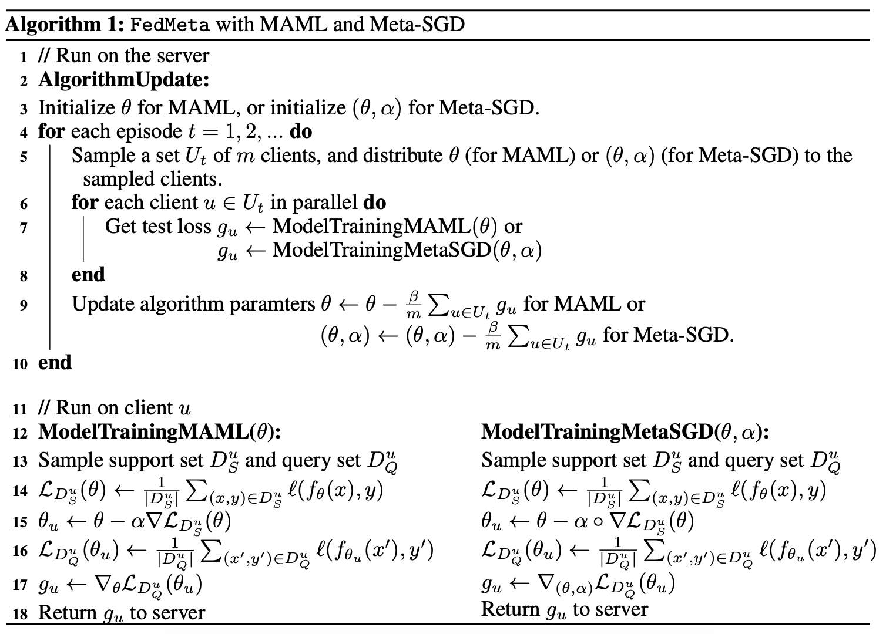
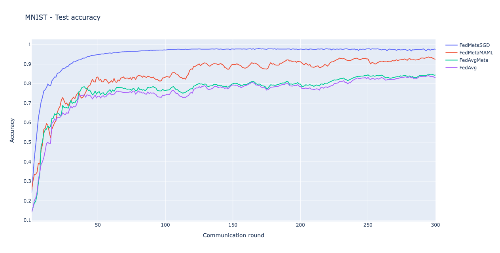
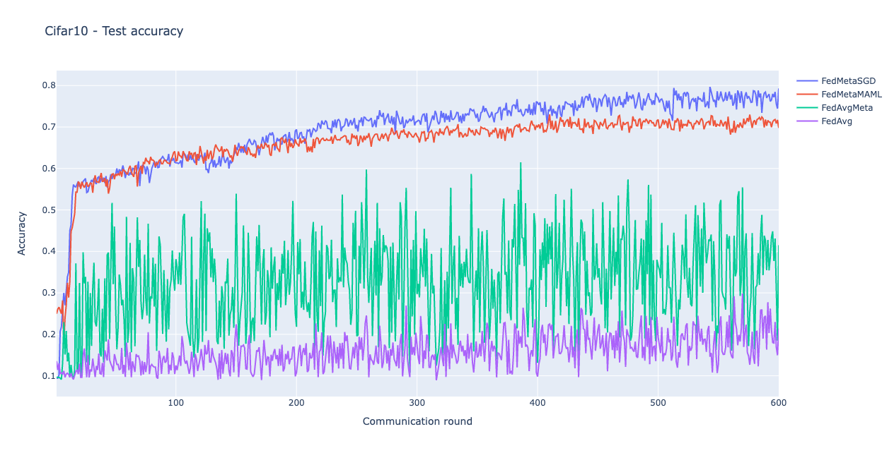
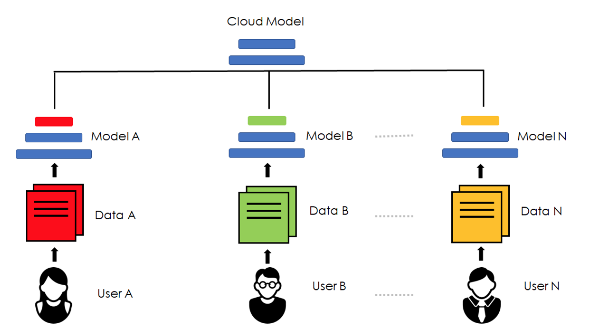
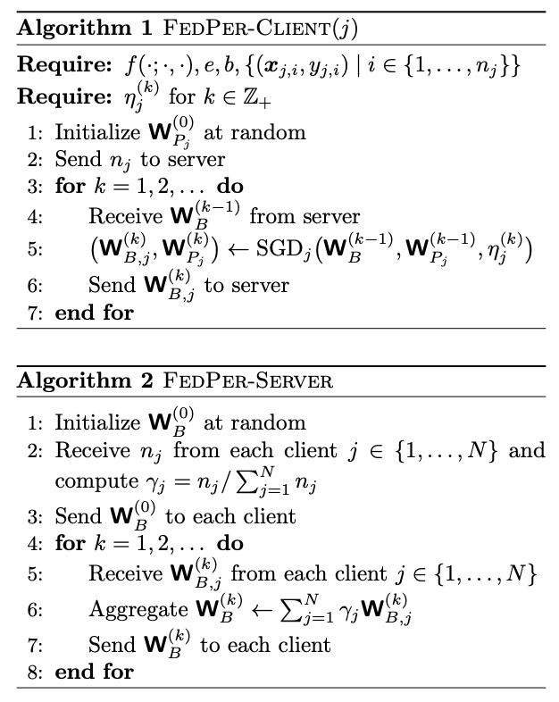
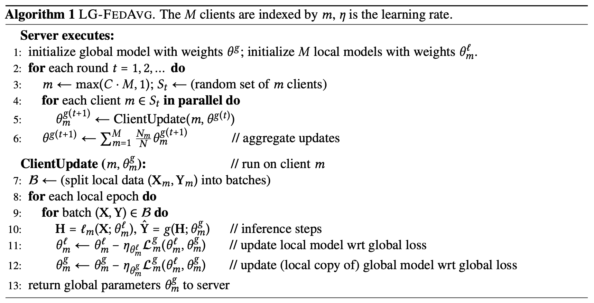
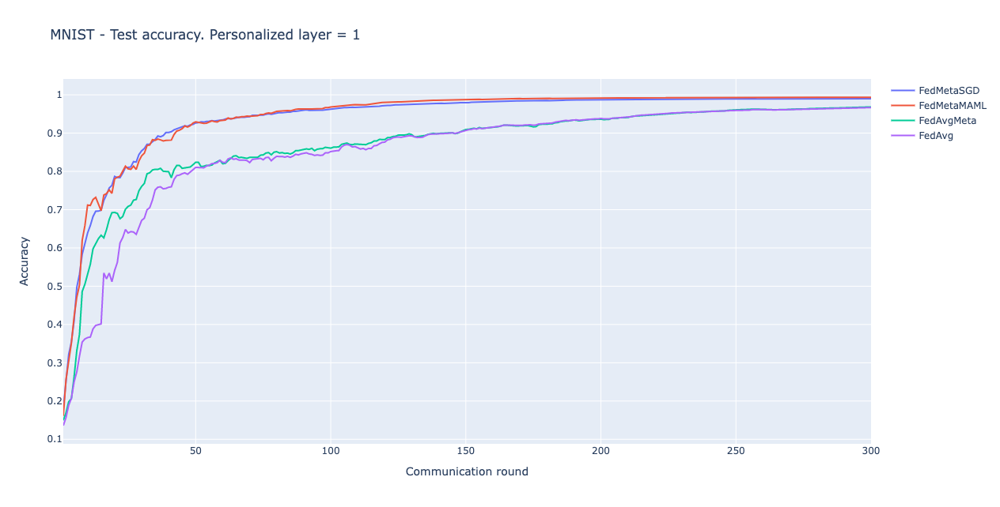
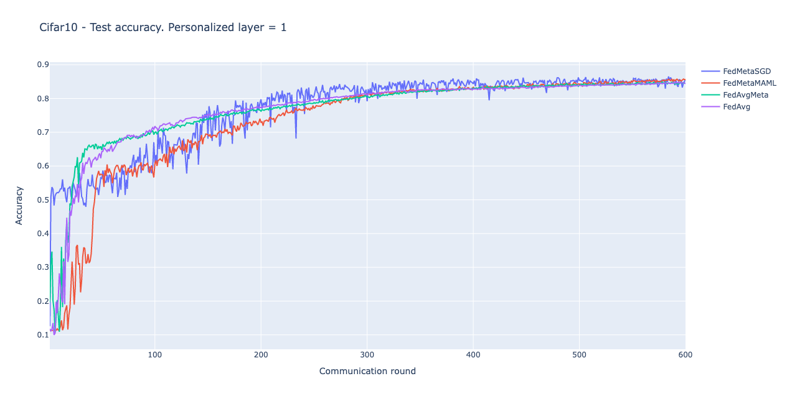

# Federated Learning & Meta Learning

## 0. Tóm tắt

- Tại báo báo này, nhóm trình bày các khảo sát liên quan đến việc tối ưu một hệ thống FL trên dữ liệu Non-IID (nghiên cứu [1]). Báo cáo tập trung vào hướng kết hợp giữa ML và FL để đạt độ chính xác cao hơn (`FedMeta` - Thuật toán đề xuất của nghiên cứu [3]). Qua quá trình thực nghiệm trên tập dữ liệu MNIST và Cifar10, nhóm chứng minh được rằng việc kết hợp giữa ML và FL giúp hệ thống FL xử lý tốt hơn các client mang dữ liệu Non-IID. Tuy nhiên, báo cáo cũng chỉ ra điểm hạn chế về độ chính xác của các thuật toán này.
- Ngoài ra, báo cáo còn tập trung khảo sát 2 thuật toán theo hướng Personalization layer (nghiên cứu [2] và [4]). Từ đó tìm ra ưu và nhược điểm của từng thuật toán. Tiến tới việc kết hợp các ưu điểm của 2 thuật toán này với các thuật toán `FedMeta`. Thực hiện thí nghiệm trên 2 tập dữ liệu MNIST và Cifar10 để chỉ ra tính hiệu quả của thuật toán mới.

## 1. Đặt vấn đề

- FL là phương pháp huấn luyện, nhằm huấn luyện mô hình máy học trực tiếp trên các tập dữ liệu riêng biệt (phân bố trên thiết bị của người dùng). So với phương pháp huấn luyện truyền thống, FL giúp đảm bảo quyền riêng tư dữ liệu của người dùng.

- Tuy nhiên, phương pháp này cũng gặp rất nhiều thách thức: Các client không đồng nhất về dữ liệu, phần cứng, không đảm bảo bảo mật, chi phí truyền tin cao. Tại đây giải quyết vấn đề dữ liệu không đồng nhất (dữ liệu Non-IID) trên các client.

## 2. Sơ lược về các dạng Non-IID data

- Dữ liệu Non-IID là dữ liệu mà ở đó, phân phối dữ liệu giữa các client là hoàn toàn khác nhau.

- Các dạng Non-IID bao gồm:
    - Non-IID về thuộc tính, thời gian: Không thuộc phạm vi giải quyết của khóa luận.
    - Non-IID về nhãn dữ liệu:
        - **Phân phối số lượng nhãn giữa các client khác nhau**: Với mọi client $i, j$: $P_i(y) \neq P_j(y)$ và $P_i(y|x) = P_j(y|x)$ (Ví dụ: Với cùng 1 ảnh $x$, các client sẽ gắn cho nó cùng 1 nhãn). Đây là loại Non-IID được xét đến trong khóa luận, điển hình cho một hệ thống Horizontal FL.
        - $P_i(y|x) \neq P_j(y|x)$: Với cùng một ảnh $x$, client $i$ có thể gắn nhãn khác với client $j$. Ví dụ, cùng một ảnh con mèo nhưng sẽ có người thích người không thích. Không được xét đến trong khóa luận.

## 3. Khảo sát hướng tối ưu hệ thống FL cho Non-IID data

- Thuật toán `FedAvg` sử dụng một server (đóng vai trò là đối tượng duy trì global model) để phân phối/tổng hợp global model tới/từ các client (đóng vai trò là đối tượng lưu trữ dữ liệu). Kiến trúc này đã được chứng minh là không thể trụ vững trước dữ liệu Non-IID.

- Các hướng tối ưu đã được đề xuất như sau:
    - Xử lý về data:
        - **Tăng cường dữ liệu**: Sinh ra ảnh mới mang một hoặc một số nhãn nhất định để giải quyết vấn đề mất cân bằng nhãn trên tập dữ liệu bên.
        - **Chia sẻ dữ liệu**: Các client chia sẻ một phần dữ liệu nhỏ cho server để huấn luyện global model, việc này có thể làm tăng accuracy lên thêm 30% bằng cách chia sẻ chỉ 5% dữ liệu người dùng. Vi phạm mục đích ban đầu về bảo mật của FL.

    - Xử lý thuật toán:
        - **Meta learning, Local finetune**: Các thuật toán Meta learning được biết đến với khả năng thích ứng tốt trên tập dữ liệu mới. Tại đây, hệ thống FL coi mỗi client là một task cần xử lý trong bài toán meta learning.
        - **Personalized layer**: Mỗi mô hình biên được chia làm 2 phần, cả 2 phần này đều được huấn luyện tại biên nhưng phần based layer do server tổng hợp và phân phối, phần personalized layer được các client duy trì. Điều này giúp cho các client thích ứng trực tiếp với dữ liệu cục bộ.
        - **Transfer learning, Multi-task learning, Life-long learning, Server optimization**: Chưa khảo sát.

    - Xử lý hệ thống:
        - **Gom cụm người dùng**: Phân client vào các cụm khác nhau. Mỗi cụm có một global model riêng. Yếu tố để phân cụm client là weight hoặc loss của client gửi về server. Tuy nhiên chi phí giao tiếp của hệ thống sẽ lớn.
        - **Thích ứng tại thiết bị biên**:  Chưa khảo sát.

## 4. `FedMeta` - thuật toán đề xuất của paper

### 4.1. Tóm tắt thuật toán

- Kết hợp các thuật toán ML bao gồm MAML và Meta-SGD vào hệ thống FL để huấn luyện một meta learner, giúp tạo ra các khởi tạo tốt khi chạy trên tập dữ liệu mới.
- Ký hiệu: 
    - $\theta$ là tham số mô hình.
    - $\alpha, \beta$ là siêu tham số.
    - $D_S^u = \{(x, y)\}, D_Q^u = \{(x', y')\}$ lần lượt là tập *support* và *query* của người dùng.
    - $l$ là hàm lỗi.
    - $m$ là số client tham gia huấn luyện trong 1 round.

- Mã giả của thuật toán được minh họa như hình dưới đây [3]:

    

### 4.2. Thí nghiệm

- Thông tin tập dữ liệu:

|                               | Cifar10 |  MNIST |
|:-----------------------------:|:-------:|:------:|
|             Số mẫu            |  60,000 | 70,000 |
|           Số client           |    50   |   50   |
| Số mẫu lớn nhất trên 1 client |   1,500 |  3,900 |

- Phân chia dữ liệu thí nghiệm: Mỗi client (mỗi episode) chỉ chứa 2 nhãn dữ liệu, được chia thành tập *support* và *query*. Trong đó, tập *support* chiếm 20% dữ liệu của client. Tập huấn luyện bao gồm 50 client, chiếm 80% tổng số mẫu dữ liệu. Tập kiểm tra bao gồm 50 client, chiếm 20% tổng số mẫu dữ liệu.

- Mô hình huấn luyện:
    - Cifar: Nhận vào ảnh có kích thước $(32\times 32\times 3)$. Sử dụng 2 layer `Convolution` để rút trích đặc trưng (kernel có kích thước $(5\times 5)$, chanel lần lượt là $6$ và $16$); 2 layer `MaxPooling` kích thước $(2\times 2)$; 3 layer tuyến tính có đầu ra lần lượt là $120, 84$ và $10$. Tất cả đều đi kèm hàm kích hoạt `ReLU` ngoại trừ layer cuối có hàm kích hoạt là `Softmax`.
    - MNIST: Nhận vào ảnh có kích thước $(28\times 28)$. Sử dụng 2 layer tuyến tính có đầu ra lần lượt là $100$ và $10$. Theo sau layer đầu tiên là hàm kích hoạt `ReLU`, theo sau layer thứ hai là hàm `Softmax`.

- Tổ chức thí nghiệm: Cả 2 tập dữ liệu đều có chung các tham số: $client/round = 5, epochs=1, batchSize=32$. Sau mỗi round huấn luyện, tiến hành kiểm tra mô hình toàn cục trên tập kiểm tra.
    - Cifar: Chạy 600 rounds, fine-tune các tham số học $\alpha$ và $\beta$.
    - MNIST: Chạy 300 rounds, fine-tune các tham số học $\alpha$ và $\beta$.
    - Đối với các thuật toán
        - Sử dụng 4 thuật toán: `FedAvg` (baseline), `FedAvgMeta`, `FedMetaMAML`, `FedMetaSGD`.
        - Thuật toán `FedAvgMeta` được huấn luyện như `FedAvg` nhưng khi test thì được phép fine-tune trên tập *query* của client. Mục đích của thuật toán này là để so sánh công bằng với các thuật toán `FedMeta`.

### 4.3. Kết quả & nhận xét

- Bảng kết kết quả:

|         | `FedAvg` | `FedAvgMeta` | `FedMetaMAML` | `FedMetaSGD` |
|:-------:|:------:|:----------:|:-----------:|:----------:|
| Cifar10 | 20.77% |   37.85%   |    71.29%   | **77.09%** |
|  MNIST  | 83.39% |   84.05%   |    92.8%    | **97.41%** |

- Nhận xét:
    - Thuật toán `FedAvg` và `FedAvgMeta` khi chạy trên tập MNIST, đều cho khả năng hội tụ tương đương nhau. Tuy nhiên, khi chạy trên tập Cifar10, chúng không thể hội tụ được. Trái lại, các thuật toán `FedMeta` không những chạy tốt trên cả 2 tập dữ liệu (đạt độ chính xác cao) mà còn cho khả năng hội tụ nhanh hơn so với `FedAvg` và `FedAvgMeta`.
    - Vấn đề cần khắc phục:
        - `FedAvg` và `FedAvgMeta` chưa đạt hội tụ trên tập dữ liệu Cifar10.
        - Các thuật toán `FedMeta` đạt độ chính xác chưa cao.

## 5. Khảo sát các thuật toán theo hướng Personalization layer

### 5.1. Thuật toán `FedPer` [2]

- Ý tưởng của thuật toán: Mạng NN được chia ra làm 2 phần: Phần base và phần personalization. Phần base bao gồm các lớp rút trích đặc trưng (ví dụ như các lớp `CNN`). Phần personalization bao gồm các lớp `fully connected`.
    - Huấn luyện: Phần base được cập nhật toàn cục như thuật toán `FedAvg` (server phân bố phần này đến các client, các client huấn luyện và gửi lại server để lấy trung bình). Mỗi client sẽ huấn luyện một phần personalization riêng. Điều này giúp các client giữ được tính riêng của bộ trọng số, phù hợp với dữ liệu của mình.

    - Kiểm thử: Sau khi kết thúc quá trình huấn luyện, tiến hành lấy trung bình phần personalization của các client. Kết quả thu được đem ghép với phần base của server. Mô hình hoàn chỉnh được sử dụng để chạy trên tập dữ liệu kiểm thử.

- Ký hiệu: $n_j$ là số mẫu tham gia huấn luyện của client $j$, $W_B$ là tham số của base layer, $W_{P, j}$ là tham số lớp personalization của client $j$.

- Mã giả của thuật toán `FedPer` được đề xuất như sau [2]:

### 5.2. Thuật toán `LG-FedAvg` [4]

- Ý tưởng: `LG-FedAvg` cũng chia mạng NN ra làm 2 phần: global và local. Phần global của `LG-FedAvg` nắm giữ các lớp `fully connected` còn phần local nắm giữ các lớp rút trích đặc trưng của mạng. Có thể coi, đây là 1 bản cài đặt ngược của thuật toán `FedPer`
    - Huấn luyện: Phần global được huấn luyện toàn cục như `FedAvg`, phần local được duy trì tại từng client.
    - Kiểm thử: Các client chứa dữ liệu test được chia làm 2 đối tượng:
        - Client cũ: Đặt trong ngữ cảnh các client đã tồn tại trong hệ thống muốn phân lớp các dữ liệu của mình. Do đó, mô hình có thể quyết định nên sử dụng phần personalization nào để thu được kết quả tốt nhất.
        - Client mới: Đặt trong ngữ cảnh các client vừa tham gia vào hệ thống. Server sẽ sử dụng từng phần personalization trước đó để kiểm định trên client này. Từ đó chọn được mạng NN tốt nhất.

- Ký hiệu:
    - $\theta^g$ là tham số của phần base (global).
    - $\theta^l_m$ là tham số phần personalization (local) của client $m$
    - $C$ là tỉ lệ client tham gia huấn luyện tại 1 round.
    - Khi đưa input $X$ qua phần personalization, ta được output $H = l_m(X, \theta^l_m)$.
    - Khi đưa $H$ qua phần base, ta được output dự đoán $\hat{Y} = g(H, \theta^g_m)$.
    - $\eta$ là siêu tham số học.

- Mã giả của thuật toán `LG-FedAvg` được đề xuất như sau [4]:

### 5.3. Nhận xét 2 thuật toán nêu trên

- Trong quá trình thực nghiệm, huấn luyện mô hình theo thuật toán `FedPer` cho độ chính xác cao hơn thuật toán `LG-FedAvg`.
- Trong quá trình kiểm thử, việc phân chia client thành 2 đối tượng như thuật toán `LG-FedAvg` đi sát với thực tế và mang lại hiệu suất cao hơn so với cách kiểm thử của thuật toán `FedPer`.
- Do đó, nhóm quyết định sử dụng các huấn luyện của thuật toán `FedPer` và cách kiểm thử của thuật toán `LG-FedAvg` trong việc xây dựng thuật toán đề xuất.

## 6. Thuật toán đề xuất

### 6.1. Tóm tắt thuật toán

- Kết hợp ý tưởng của `FedPer` với `FedMeta` bằng cách huấn luyện mô hình theo hướng meta learning đồng thời giữ lại một phần mạng neural để huấn luyện trực tiếp tại thiết bị biên (phần personalization bao gồm các lớp `fully connected`).

- Tại quá trình kiểm thử, tiến hành kiểm thử trên các client cũ. Do đó, có thể xác định được các lớp personalization tốt nhất cho các client này.

### 6.2. Thí nghiệm

- Thông tin tập dữ liệu và mô hình huấn luyện: Như đã nêu ở thí nghiệm trên.
- Tổ chức thí nghiệm: Cả 2 tập dữ liệu đều có chung các tham số: $client/round = 5, epochs=1, batchSize=32$. Sau mỗi round huấn luyện, tiến hành kiểm tra mô hình trên tập kiểm tra.
    - Cifar: Chạy 600 round, dùng lại các siêu tham số như ở thí nghiệm trước, fine-tune số lớp dùng làm personalized layer.
    - MNIST: Chạy 300 round, dùng lại các siêu tham số như ở thí nghiệm trước, số lớp personalization là 1.

### 6.3. Kết quả & Nhận xét

- Bảng kết kết quả:

|         |`FedAvg`|`FedAvgMeta`|`FedMetaMAML`|`FedMetaSGD`|
|:-------:|:------:|:----------:|:-----------:|:----------:|
| Cifar10 | 84.59% |   84.55%   |  **85.46%** |     84.96% |
|  MNIST  |  96.53%|   96.65%   | **99.36%**  | 99.01%     |

<!-- fedMeta
|         | FedAvg | FedAvgMeta | FedMetaMAML | FedMetaSGD |
|:-------:|:------:|:----------:|:-----------:|:----------:|
| Cifar10 | 16.62% |   30.79%   |    75.52%   | **76.54%** |
|  MNIST  |  82.9% |   83.57%   |    93.46%   | **95.03%** |
 -->

- Nhận xét:
    - Khi kết hợp Personalized layer cho các thuật toán `FedAvg`, `FedAvgMeta`, `FedMetaMAML`, `FedMetaSGD` và kiểm thử trên các client đã biết trước phân phối dữ liệu, các độ chính xác thu được thu được đều lớn hơn so với các thuật toán trong thí nghiệm của `FedMeta`.
    - Xét về khả năng hội tụ, thuật toán mới cho khả năng hội tụ nhanh hơn. Đối với MNIST, các thuật toán `FedMeta+FedPer` hội tụ tại round 150 (trong khi đó, `FedMetaMAML` cần 250 round để hội tụ). Đối với Cifar10, `FedMeta+FedPer` gần như hội tụ tại round 400 (trong khi đó, `FedMeta` cần 600 round để hội tụ).
    - Riêng đối với thuật toán `FedAvg` và `FedAvgMeta`, khi kết hợp với Personalization layer, đã đạt hội tụ trên tập dữ liệu Cifar10.
    - Trên tập dữ liệu Cifar10, quá trình hội tụ của các thuật toán `FedAvg` và `FedAvgMeta` tuy nhanh hơn nhưng kết quả cuối của thuật toán lại thấp hơn các thuật toán `FedMeta`.

## Tài liệu tham khảo

[1]: Federated Learning on Non-IID Data: A Survey, URL: https://arxiv.org/pdf/2106.06843.pdf
[2]: Federated Learning with Personalization Layers, URL: https://arxiv.org/pdf/1912.00818.pdf
[3]: Federated Meta-Learning with Fast Convergence and Efficient Communication, URL: https://arxiv.org/pdf/1802.07876.pdf
[4]: Think Locally, Act Globally: Federated Learning with Local and Global Representations, URL: https://arxiv.org/pdf/2001.01523.pdf
