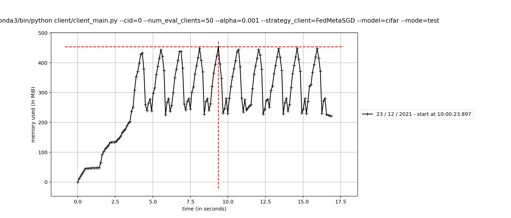
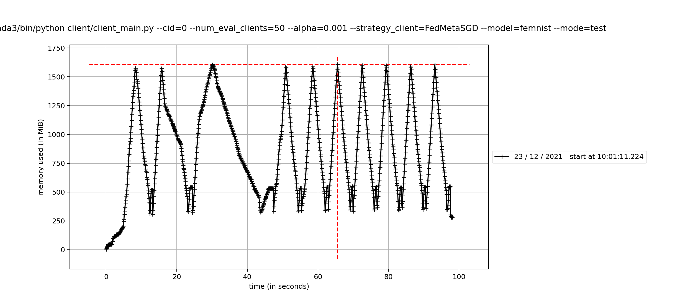

# Báo cáo lượng RAM tiêu thụ

## Thí nghiệm

- Tiến hành thí nghiệm trên 2 tập dữ liệu Cifar10 và EMNIST
- Thông tin về tập dữ liệu:

|                               | Cifar10 |  EMNIST |
|:-----------------------------:|:-------:|:-------:|
|             Số mẫu            |  60.000 | 100.000 |
|           Số client           |    50   |   300   |
|   Số client tham gia 1 round  |    5    |    5    |
| Số mẫu lớn nhất trên 1 client |   320   |   736   |

- Các bước tiến hành thí nghiệm:
    - Chọn ra client có số mẫu lớn nhất của mỗi tập dữ liệu.
    - Sử dụng thuật toán tiêu tốn nhiều RAM nhất: FedMetaSGD.
    - Chạy 10 round.
    - Đo lượng RAM tiêu tốn trên client có số mẫu lớn nhất của mỗi tập dữ liệu.

## Kết quả thí nghiệm

- Lượng RAM tiêu tốn của client chứa nhiều dữ liệu nhất trên Cifar10 và EMNIST được ghi lại bằng 2 biểu đồ sau:

    
    

- Đọc biểu đồ:
    - Các cực đại của biểu đồ biểu thị quá trình huấn luyện.
    - Các cực tiểu của biểu đồ là dữ liệu huấn luyện không được giải phóng. (Em có tham khảo từ khóa luận của chị Bùi Thị Cẩm Nhung và biết được: Khi sử dụng Flower, client chỉ giải phóng dữ liệu sau khi nó bị tắt đi.)
    - Rõ ràng, số RAM tiêu tốn cho EMNIST là nhiều hơn cho Cifar10. Do đó, thực hiện tính toán lượng RAM cần thiết trên tập EMNIST.

- Ước lượng RAM tiêu tốn: 

$$RAM = \text{Đỉnh} \times \text{Client/round} + \text{Đáy}\times \text{(Tổng client - Client/round)}$$

$$RAM = 1625MB\times 5 + 250MB\times(300-5) = 81875MB = 81.875GB$$

- Về số nhân CPU cần thiết, sau khi tham khảo khóa luận của chị Nhung, em ước lượng cần sử dụng 25 core CPU.

- Về dung lượng đĩa cứng cần thiết, bọn em cần lưu các tập dữ liệu, các kết quả tính toán liên quan và các file sinh ra trong quá trình huấn luyện. Do đó, chỉ cần khoảng 20GB.

**Tóm lại, cấu hình ước lượng của bọn em bao gồm 81.875 VRAM GPU, 25 core CPU và 20GB ổ cứng lưu trữ.**